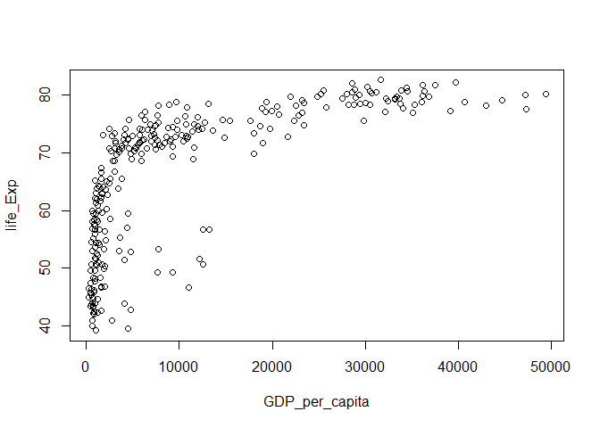
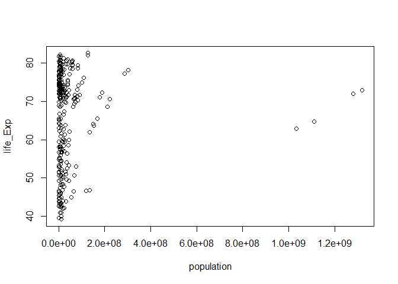

Hw01\_Ex02 R Markdown for Gapminder exploration
================
Stanley Nam
September 17, 2019

<!-- TODO: more tinkering with the YAML header??? -->

# First things first: view the whole dataset

How much rows does the gapminder dataset have?

And what are the first ten rows look like?

``` r
nrow(gapminder)
```

    ## [1] 1704

``` r
head(gapminder, 10)
```

    ## # A tibble: 10 x 6
    ##    country     continent  year lifeExp      pop gdpPercap
    ##    <fct>       <fct>     <int>   <dbl>    <int>     <dbl>
    ##  1 Afghanistan Asia       1952    28.8  8425333      779.
    ##  2 Afghanistan Asia       1957    30.3  9240934      821.
    ##  3 Afghanistan Asia       1962    32.0 10267083      853.
    ##  4 Afghanistan Asia       1967    34.0 11537966      836.
    ##  5 Afghanistan Asia       1972    36.1 13079460      740.
    ##  6 Afghanistan Asia       1977    38.4 14880372      786.
    ##  7 Afghanistan Asia       1982    39.9 12881816      978.
    ##  8 Afghanistan Asia       1987    40.8 13867957      852.
    ##  9 Afghanistan Asia       1992    41.7 16317921      649.
    ## 10 Afghanistan Asia       1997    41.8 22227415      635.

# What I want to do

Investigate factors behind the different life expectancies using
contemporary data.

# Samples later than 2000

We are living in the 21st century. Why not give more weight on the
contemporary data (from 2001)?

``` r
contempData <- gapminder[which(gapminder$year > 2000),]
```

Now I’m a bit concerned: do we have enough data points? Provide
descriptive statistics of the dataset.

``` r
summary(contempData)
```

    ##         country       continent        year         lifeExp     
    ##  Afghanistan:  2   Africa  :104   Min.   :2002   Min.   :39.19  
    ##  Albania    :  2   Americas: 50   1st Qu.:2002   1st Qu.:56.73  
    ##  Algeria    :  2   Asia    : 66   Median :2004   Median :71.21  
    ##  Angola     :  2   Europe  : 60   Mean   :2004   Mean   :66.35  
    ##  Argentina  :  2   Oceania :  4   3rd Qu.:2007   3rd Qu.:75.86  
    ##  Australia  :  2                  Max.   :2007   Max.   :82.60  
    ##  (Other)    :272                                                
    ##       pop              gdpPercap      
    ##  Min.   :1.704e+05   Min.   :  241.2  
    ##  1st Qu.:4.326e+06   1st Qu.: 1576.6  
    ##  Median :1.041e+07   Median : 5741.8  
    ##  Mean   :4.274e+07   Mean   :10799.0  
    ##  3rd Qu.:2.967e+07   3rd Qu.:15941.5  
    ##  Max.   :1.319e+09   Max.   :49357.2  
    ## 

# Factors that influence life expectancy

## Correlation between GDP per capita and life expectancy

…although it seems obvious that the rich live longer.

Plot GDP on the y-axis and Life Expectancy on the x-axis:

<!-- -->

## correlation between population and Life Expectancy

This one is less obvious, but research (Calhoun, J.B., 1973. Death
squared: the explosive growth and demise of a mouse population. Proc. R.
Soc. Med. 66, 80–88.) may indicate that larger population (higher
population density, to be honest) has a negative effect on the life
expectancy.

Plot population on the y-axis and Life Expectancy on the x-axis:

<!-- -->
