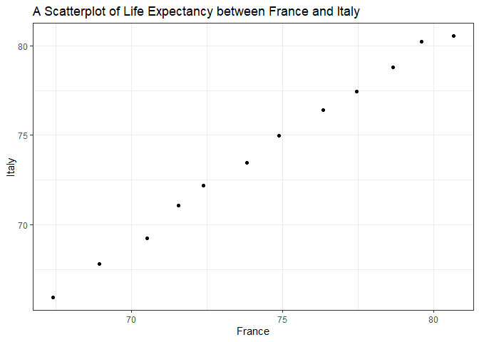

# Exercise 1: Univariate data reshaping

## Univariate Option 1

First, I am going to make a tibble with one row per year, and columns for life expectancy for France and Italy. I have chosen them as they are Romance-language-speaking countries with considerable consumption of red wine. Previous research has found out consumption of red wine reduces the rate of heart attack and thus it is expected to increase life expectancy. And then, I am going to use the new data shape to scatterplot life expectancy for one country against that of another. Finally, I am going to re-lengthen the data.

### 1. A tibble that has first column for year and two columns for the two countries.


```r
FI_life <- gapminder %>%
  filter(country == "France" | country == "Italy") %>% 
  select(year, country, lifeExp) %>% 
  pivot_wider(id_cols = year,
              names_from = country,
              values_from = lifeExp)

FI_life
```

```
## # A tibble: 12 x 3
##     year France Italy
##    <int>  <dbl> <dbl>
##  1  1952   67.4  65.9
##  2  1957   68.9  67.8
##  3  1962   70.5  69.2
##  4  1967   71.6  71.1
##  5  1972   72.4  72.2
##  6  1977   73.8  73.5
##  7  1982   74.9  75.0
##  8  1987   76.3  76.4
##  9  1992   77.5  77.4
## 10  1997   78.6  78.8
## 11  2002   79.6  80.2
## 12  2007   80.7  80.5
```

### 2. A scatterplot out of the tibble


```r
FI_life %>%
  ggplot(aes(x = France, y = Italy)) +
  geom_point() +
  labs(title = "A Scatterplot of Life Expectancy between France and Italy",
       x = "France",
       y = "Italy") + 
  theme_bw()
```

<!-- -->

### 3. Re-lengthening the data


```r
FI_life %>% 
  pivot_longer(cols = c(France, Italy),
               names_to = "country",
               values_to = "lifeExp") %>% 
  arrange(country) %>% 
  datatable()
```

<!--html_preserve--><div id="htmlwidget-4ef6287adbf17bdc1b01" style="width:100%;height:auto;" class="datatables html-widget"></div>
<script type="application/json" data-for="htmlwidget-4ef6287adbf17bdc1b01">{"x":{"filter":"none","data":[["1","2","3","4","5","6","7","8","9","10","11","12","13","14","15","16","17","18","19","20","21","22","23","24"],[1952,1957,1962,1967,1972,1977,1982,1987,1992,1997,2002,2007,1952,1957,1962,1967,1972,1977,1982,1987,1992,1997,2002,2007],["France","France","France","France","France","France","France","France","France","France","France","France","Italy","Italy","Italy","Italy","Italy","Italy","Italy","Italy","Italy","Italy","Italy","Italy"],[67.41,68.93,70.51,71.55,72.38,73.83,74.89,76.34,77.46,78.64,79.59,80.657,65.94,67.81,69.24,71.06,72.19,73.48,74.98,76.42,77.44,78.82,80.24,80.546]],"container":"<table class=\"display\">\n  <thead>\n    <tr>\n      <th> <\/th>\n      <th>year<\/th>\n      <th>country<\/th>\n      <th>lifeExp<\/th>\n    <\/tr>\n  <\/thead>\n<\/table>","options":{"columnDefs":[{"className":"dt-right","targets":[1,3]},{"orderable":false,"targets":0}],"order":[],"autoWidth":false,"orderClasses":false}},"evals":[],"jsHooks":[]}</script><!--/html_preserve-->


# Exercise 2: Multivariate data reshaping

## Multivariate Option 1

In this question, I am going to make a tibble with one row per year, and columns for life expectancy *and* GDP per capita for Oceanian countries (i.e., Australia and New Zealand).

After generating the tibble as above, I am going to re-lengthen the data.

### 1. A tibble with one column for year and other columns for the life expectancy and GDP per capita of the two countries


```r
oceanianData <-
  gapminder %>% 
  filter(continent == "Oceania") %>% 
  select(year, country, lifeExp, gdpPercap) %>% 
  pivot_wider(id_cols = year,
              names_from = country,
              names_sep = "_",
              values_from = c(lifeExp, gdpPercap))

datatable(oceanianData)
```

<!--html_preserve--><div id="htmlwidget-3194b229f2b8cf2988ca" style="width:100%;height:auto;" class="datatables html-widget"></div>
<script type="application/json" data-for="htmlwidget-3194b229f2b8cf2988ca">{"x":{"filter":"none","data":[["1","2","3","4","5","6","7","8","9","10","11","12"],[1952,1957,1962,1967,1972,1977,1982,1987,1992,1997,2002,2007],[69.12,70.33,70.93,71.1,71.93,73.49,74.74,76.32,77.56,78.83,80.37,81.235],[69.39,70.26,71.24,71.52,71.89,72.22,73.84,74.32,76.33,77.55,79.11,80.204],[10039.59564,10949.64959,12217.22686,14526.12465,16788.62948,18334.19751,19477.00928,21888.88903,23424.76683,26997.93657,30687.75473,34435.36744],[10556.57566,12247.39532,13175.678,14463.91893,16046.03728,16233.7177,17632.4104,19007.19129,18363.32494,21050.41377,23189.80135,25185.00911]],"container":"<table class=\"display\">\n  <thead>\n    <tr>\n      <th> <\/th>\n      <th>year<\/th>\n      <th>lifeExp_Australia<\/th>\n      <th>lifeExp_New Zealand<\/th>\n      <th>gdpPercap_Australia<\/th>\n      <th>gdpPercap_New Zealand<\/th>\n    <\/tr>\n  <\/thead>\n<\/table>","options":{"columnDefs":[{"className":"dt-right","targets":[1,2,3,4,5]},{"orderable":false,"targets":0}],"order":[],"autoWidth":false,"orderClasses":false}},"evals":[],"jsHooks":[]}</script><!--/html_preserve-->

### 2. Re-lengthening


```r
oceanianData %>% 
  pivot_longer(cols = -year,
               names_to = c(".value", "country"),
               names_sep = "_") %>% 
  datatable()
```

<!--html_preserve--><div id="htmlwidget-2d77cd04be7562f473cc" style="width:100%;height:auto;" class="datatables html-widget"></div>
<script type="application/json" data-for="htmlwidget-2d77cd04be7562f473cc">{"x":{"filter":"none","data":[["1","2","3","4","5","6","7","8","9","10","11","12","13","14","15","16","17","18","19","20","21","22","23","24"],[1952,1952,1957,1957,1962,1962,1967,1967,1972,1972,1977,1977,1982,1982,1987,1987,1992,1992,1997,1997,2002,2002,2007,2007],["Australia","New Zealand","Australia","New Zealand","Australia","New Zealand","Australia","New Zealand","Australia","New Zealand","Australia","New Zealand","Australia","New Zealand","Australia","New Zealand","Australia","New Zealand","Australia","New Zealand","Australia","New Zealand","Australia","New Zealand"],[69.12,69.39,70.33,70.26,70.93,71.24,71.1,71.52,71.93,71.89,73.49,72.22,74.74,73.84,76.32,74.32,77.56,76.33,78.83,77.55,80.37,79.11,81.235,80.204],[10039.59564,10556.57566,10949.64959,12247.39532,12217.22686,13175.678,14526.12465,14463.91893,16788.62948,16046.03728,18334.19751,16233.7177,19477.00928,17632.4104,21888.88903,19007.19129,23424.76683,18363.32494,26997.93657,21050.41377,30687.75473,23189.80135,34435.36744,25185.00911]],"container":"<table class=\"display\">\n  <thead>\n    <tr>\n      <th> <\/th>\n      <th>year<\/th>\n      <th>country<\/th>\n      <th>lifeExp<\/th>\n      <th>gdpPercap<\/th>\n    <\/tr>\n  <\/thead>\n<\/table>","options":{"columnDefs":[{"className":"dt-right","targets":[1,3,4]},{"orderable":false,"targets":0}],"order":[],"autoWidth":false,"orderClasses":false}},"evals":[],"jsHooks":[]}</script><!--/html_preserve-->


# Exercise 3: Table Joins


## 3.1 

For each guest in the guestlist (*guest* tibble), add a column for email address, which can be found in the *email* tibble.


```r
email <- email %>% 
  separate_rows(guest, sep = ', ') %>% # tibble email has different names concatenated in a row so separate them
  rename(name = guest)  # As in the guest tibble the names are under a column named 'name,' I'm using the same for the email tibble

guest %>% 
  left_join(email, by = "name")
```

```
## # A tibble: 30 x 8
##    party name  meal_wedding meal_brunch attendance_wedd~ attendance_brun~
##    <dbl> <chr> <chr>        <chr>       <chr>            <chr>           
##  1     1 Somm~ PENDING      PENDING     PENDING          PENDING         
##  2     1 Phil~ vegetarian   Menu C      CONFIRMED        CONFIRMED       
##  3     1 Blan~ chicken      Menu A      CONFIRMED        CONFIRMED       
##  4     1 Emaa~ PENDING      PENDING     PENDING          PENDING         
##  5     2 Blai~ chicken      Menu C      CONFIRMED        CONFIRMED       
##  6     2 Nige~ <NA>         <NA>        CANCELLED        CANCELLED       
##  7     3 Sine~ PENDING      PENDING     PENDING          PENDING         
##  8     4 Ayra~ vegetarian   Menu B      PENDING          PENDING         
##  9     5 Atla~ PENDING      PENDING     PENDING          PENDING         
## 10     5 Denz~ fish         Menu B      CONFIRMED        CONFIRMED       
## # ... with 20 more rows, and 2 more variables: attendance_golf <chr>,
## #   email <chr>
```

## 3.2

Who do we have emails for, yet are not on the guestlist?


```r
email %>%
  anti_join(guest, by = "name")
```

```
## # A tibble: 3 x 2
##   name            email                          
##   <chr>           <chr>                          
## 1 Turner Jones    tjjones12@hotmail.ca           
## 2 Albert Marshall themarshallfamily1234@gmail.com
## 3 Vivian Marshall themarshallfamily1234@gmail.com
```

## 3.3

Make a guestlist that includes everyone we have emails for (in addition to those on the original guestlist).


```r
email %>%
  full_join(guest, by = "name") %>%
  select(-party) %>% # For some reason, we have another column called 'party.' Basically, persons with the same email share a value in this column. We don't need this so remove it.
  datatable()
```

<!--html_preserve--><div id="htmlwidget-b9bfdef9c862760931bb" style="width:100%;height:auto;" class="datatables html-widget"></div>
<script type="application/json" data-for="htmlwidget-b9bfdef9c862760931bb">{"x":{"filter":"none","data":[["1","2","3","4","5","6","7","8","9","10","11","12","13","14","15","16","17","18","19","20","21","22","23","24","25","26","27","28","29","30","31","32","33"],["Sommer Medrano","Phillip Medrano","Blanka Medrano","Emaan Medrano","Blair Park","Nigel Webb","Sinead English","Ayra Marks","Jolene Welsh","Hayley Booker","Amayah Sanford","Erika Foley","Ciaron Acosta","Diana Stuart","Daisy-May Caldwell","Martin Caldwell","Violet Caldwell","Nazifa Caldwell","Eric Caldwell","Rosanna Bird","Kurtis Frost","Huma Stokes","Samuel Rutledge","Eddison Collier","Stewart Nicholls","Turner Jones","Albert Marshall","Vivian Marshall","Atlanta Connolly","Denzel Connolly","Chanelle Shah","Cosmo Dunkley","Cai Mcdaniel"],["sommm@gmail.com","sommm@gmail.com","sommm@gmail.com","sommm@gmail.com","bpark@gmail.com","bpark@gmail.com","singlish@hotmail.ca","marksa42@gmail.com","jw1987@hotmail.com","jw1987@hotmail.com","erikaaaaaa@gmail.com","erikaaaaaa@gmail.com","shining_ciaron@gmail.com","doodledianastu@gmail.com","caldwellfamily5212@gmail.com","caldwellfamily5212@gmail.com","caldwellfamily5212@gmail.com","caldwellfamily5212@gmail.com","caldwellfamily5212@gmail.com","rosy1987b@gmail.com","rosy1987b@gmail.com","humastokes@gmail.com","humastokes@gmail.com","eddison.collier@gmail.com","eddison.collier@gmail.com","tjjones12@hotmail.ca","themarshallfamily1234@gmail.com","themarshallfamily1234@gmail.com",null,null,null,null,null],["PENDING","vegetarian","chicken","PENDING","chicken",null,"PENDING","vegetarian",null,"vegetarian",null,"PENDING","PENDING","vegetarian","chicken","PENDING","PENDING","chicken","chicken","vegetarian","PENDING",null,"chicken","PENDING","chicken",null,null,null,"PENDING","fish","chicken","PENDING","fish"],["PENDING","Menu C","Menu A","PENDING","Menu C",null,"PENDING","Menu B",null,"Menu C","PENDING","PENDING","Menu A","Menu C","Menu B","PENDING","PENDING","PENDING","Menu B","Menu C","PENDING",null,"Menu C","PENDING","Menu B",null,null,null,"PENDING","Menu B","Menu C","PENDING","Menu C"],["PENDING","CONFIRMED","CONFIRMED","PENDING","CONFIRMED","CANCELLED","PENDING","PENDING","CANCELLED","CONFIRMED","CANCELLED","PENDING","PENDING","CONFIRMED","CONFIRMED","PENDING","PENDING","PENDING","CONFIRMED","CONFIRMED","PENDING","CANCELLED","CONFIRMED","PENDING","CONFIRMED",null,null,null,"PENDING","CONFIRMED","CONFIRMED","PENDING","CONFIRMED"],["PENDING","CONFIRMED","CONFIRMED","PENDING","CONFIRMED","CANCELLED","PENDING","PENDING","CANCELLED","CONFIRMED","PENDING","PENDING","PENDING","CONFIRMED","CONFIRMED","PENDING","PENDING","PENDING","CONFIRMED","CONFIRMED","PENDING","CANCELLED","CONFIRMED","PENDING","CONFIRMED",null,null,null,"PENDING","CONFIRMED","CONFIRMED","PENDING","CONFIRMED"],["PENDING","CONFIRMED","CONFIRMED","PENDING","CONFIRMED","CANCELLED","PENDING","PENDING","CANCELLED","CONFIRMED","PENDING","PENDING","PENDING","CONFIRMED","CONFIRMED","PENDING","PENDING","PENDING","CONFIRMED","CONFIRMED","PENDING","CANCELLED","CONFIRMED","PENDING","CONFIRMED",null,null,null,"PENDING","CONFIRMED","CONFIRMED","PENDING","CONFIRMED"]],"container":"<table class=\"display\">\n  <thead>\n    <tr>\n      <th> <\/th>\n      <th>name<\/th>\n      <th>email<\/th>\n      <th>meal_wedding<\/th>\n      <th>meal_brunch<\/th>\n      <th>attendance_wedding<\/th>\n      <th>attendance_brunch<\/th>\n      <th>attendance_golf<\/th>\n    <\/tr>\n  <\/thead>\n<\/table>","options":{"order":[],"autoWidth":false,"orderClasses":false,"columnDefs":[{"orderable":false,"targets":0}]}},"evals":[],"jsHooks":[]}</script><!--/html_preserve-->
