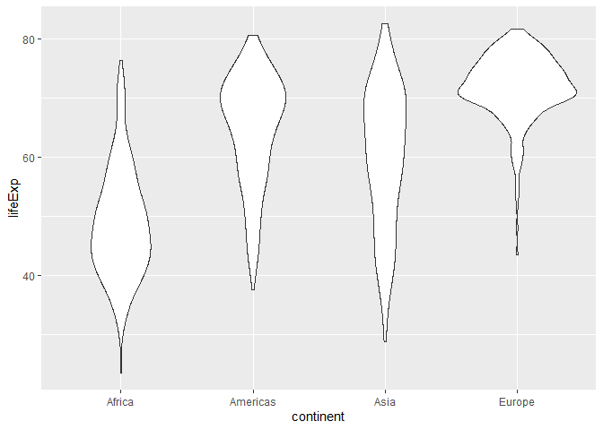
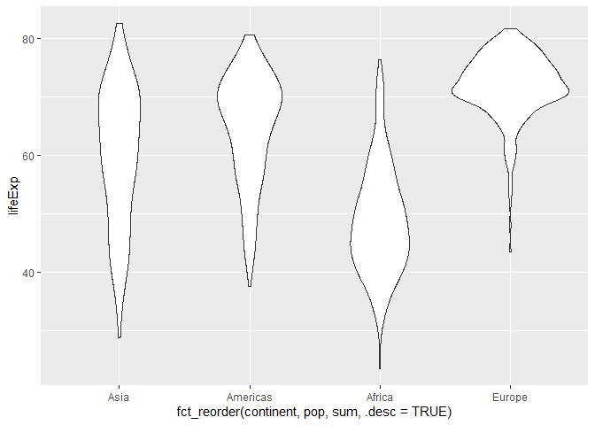
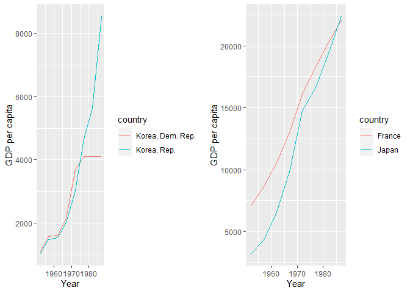

# Exercise 1: Explain the value of the here::here package

For the cause of replicability, my data analysis should be disseminated with the intermediate process. So, in addition to the results and discussion section, I may provide the raw data and the R codes that I used to manipulate/analyze such data. However, not everyone has the same environment as I do: different OS's, different directory hierarchies (which makes things difficult to use absolute paths) and so one. Therefore, I should return the environment to the Tabula Rasa and fix it there before actually running the process. Previous practices, something that I actually used in a [previous project](), incorporate the use of the **rm()** and **setwd()** function. However, they simply mask the problem without providing a real solution! 

More problematic is some untold assumptions that were made in the process from my side. For example, previously loaded packages may have overwritten functions I intended to use! As such packages are not attached without an explicit statement, researchers trying to replicate my analysis would get different results. Therefore, it would be a better practice, not just for disseminating the data and analysis process but as a general habit in writing R codes, to start any code with the  **here** package.

# Exercise 2: Factor management

I chose to work on the *gapminder* dataset. It has two factor variables *continent* and *country*. Between the two, my focus is on *continent*. Specifically, the datapoints associated with Oceania will be dropped.

Before we dive in the actual analysis, let's make sure that these two variables are actually factors.


```r
gapminder
```

```
## # A tibble: 1,704 x 6
##    country     continent  year lifeExp      pop gdpPercap
##    <fct>       <fct>     <int>   <dbl>    <int>     <dbl>
##  1 Afghanistan Asia       1952    28.8  8425333      779.
##  2 Afghanistan Asia       1957    30.3  9240934      821.
##  3 Afghanistan Asia       1962    32.0 10267083      853.
##  4 Afghanistan Asia       1967    34.0 11537966      836.
##  5 Afghanistan Asia       1972    36.1 13079460      740.
##  6 Afghanistan Asia       1977    38.4 14880372      786.
##  7 Afghanistan Asia       1982    39.9 12881816      978.
##  8 Afghanistan Asia       1987    40.8 13867957      852.
##  9 Afghanistan Asia       1992    41.7 16317921      649.
## 10 Afghanistan Asia       1997    41.8 22227415      635.
## # ... with 1,694 more rows
```

It is explicitly shown that *country* and *continent* are actually <fctr> (factor) variables, and *continent* has five levels: "Africa", "Americas", "Asia", "Europe" and "Oceania" as shown below


```r
levels(gapminder$continent)
```

```
## [1] "Africa"   "Americas" "Asia"     "Europe"   "Oceania"
```

## 2.1 Drop factor / levels

The reason I chose to drop "Oceania" is simple: it has the fewest number of data points.


```r
no_oceania <- gapminder %>% 
  filter(continent != "Oceania") %>% # everything except Oceania
  droplevels() #drop the unused level (i.e., Oceania). 

levels(no_oceania)
```

```
## NULL
```

As shown above, Oceania is not one of the continents in the *no_oceania* dataset.

## 2.2 Reordering levels
Let us plot the distribution of life expectancy of the four continents without Oceania.


```r
no_oceania %>%
  group_by(continent) %>%
  ggplot(aes(continent, lifeExp)) +
  geom_violin()
```

<!-- -->

Now let's try to reorder the x-axis. How about having the one with the largest population comes first? Let's do this.


```r
no_oceania %>%
  group_by(continent) %>%
  ggplot() +
  geom_violin(
    aes(fct_reorder(continent, pop, sum, .desc = TRUE), # for each continent, sum(pop) and then sort in the ASCENDING order
        lifeExp)
    )
```

<!-- -->

As we all know, Asia has the largest population followed by Americas, Africa and Europe. So the violin plots are presented in that order.

# Exercise 3: File I/O
In this exercise, I'm going to summarize the life expectancy data in 'no_oceania' tibble, which I've just generated above, and  export it to disk. And then I'll reload the exported file.

First, let's summarize the tibble so that the average and standard deviation of life expectancy are calculated by countires. After that, let's export the data.


```r
no_oceania %>%
  group_by(country) %>%
  summarize(averageLifeExp = mean(lifeExp),
            sdLifeExp = sd(lifeExp)) %>%
  write_csv(here::here("hw05", "data","ex03_lifeExp.csv"))
```

Now let's import the exported .csv file from the disk!


```r
imported <- read_csv(here::here("hw05", "data","ex03_lifeExp.csv"))
```

```
## Parsed with column specification:
## cols(
##   country = col_character(),
##   averageLifeExp = col_double(),
##   sdLifeExp = col_double()
## )
```

```r
imported
```

```
## # A tibble: 140 x 3
##    country     averageLifeExp sdLifeExp
##    <chr>                <dbl>     <dbl>
##  1 Afghanistan           37.5      5.10
##  2 Albania               68.4      6.32
##  3 Algeria               59.0     10.3 
##  4 Angola                37.9      4.01
##  5 Argentina             69.1      4.19
##  6 Austria               73.1      4.38
##  7 Bahrain               65.6      8.57
##  8 Bangladesh            49.8      9.03
##  9 Belgium               73.6      3.78
## 10 Benin                 48.8      6.13
## # ... with 130 more rows
```

Looking good, except for the fact that the country is not a *factor* variable as shown below! So the datatype didn't survive the round trip of writing to file then reading back in.


```r
class(imported$country)
```

```
## [1] "character"
```

However, when we re-order the country by the averageLifeExp, it would be changed into *factor* before reordered.


```r
imported %>% 
  mutate(country = fct_reorder(country, averageLifeExp, .desc = TRUE)) %>% 
  arrange(country)
```

```
## # A tibble: 140 x 3
##    country     averageLifeExp sdLifeExp
##    <fct>                <dbl>     <dbl>
##  1 Iceland               76.5      3.03
##  2 Sweden                76.2      3.00
##  3 Norway                75.8      2.42
##  4 Netherlands           75.6      2.49
##  5 Switzerland           75.6      4.01
##  6 Canada                74.9      3.95
##  7 Japan                 74.8      6.49
##  8 Denmark               74.4      2.22
##  9 France                74.3      4.30
## 10 Spain                 74.2      5.16
## # ... with 130 more rows
```

# Exercise 4: Visualization design

In homework 2, I showed in a graph how South Korean economy came from behind and overtook North Korean economy.

Here, I'm going to make a similar analysis between Japan and France and put it side-by-side to that of two Koreas.


```r
twoKOR <- gapminder %>%
  filter(country == "Korea, Dem. Rep." | country=="Korea, Rep.") %>%
  filter(year < 1990) %>%
  ggplot() +
  geom_line(aes(year, gdpPercap, group = country, color = country)) +
  xlab("Year") +
  ylab("GDP per capita") +
  theme(legend.position = "right")

japFra <- gapminder %>%
  filter(country == "Japan" | country=="France") %>%
  filter(year < 1990) %>%
  ggplot() +
  geom_line(aes(year, gdpPercap, group = country, color = country)) +
  xlab("Year") +
  ylab("GDP per capita") +
  theme(legend.position = "right")

grid.arrange(twoKOR, japFra, nrow = 1)
```

<!-- -->


# Exercise 5: Writing figures to file
As *japFra* is a new figure that I made this week, I'm going to save in the disk.


```r
ggsave(filename = "Japan_and_France", plot = japFra, device = "png", path = here::here("hw05"))
```

```
## Saving 7 x 5 in image
```

The output file is [here](https://stat545-ubc-hw-2019-20.github.io/stat545-hw-stannam/hw05/Japan_and_France.png)
